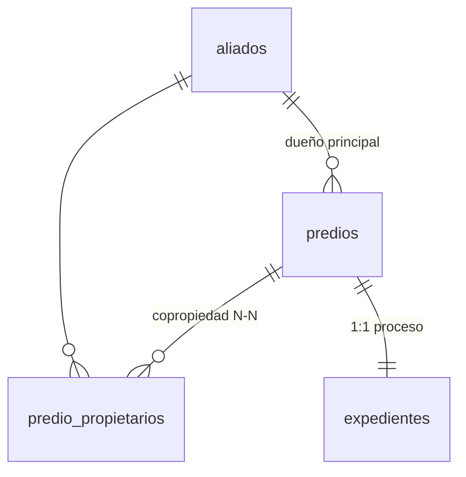
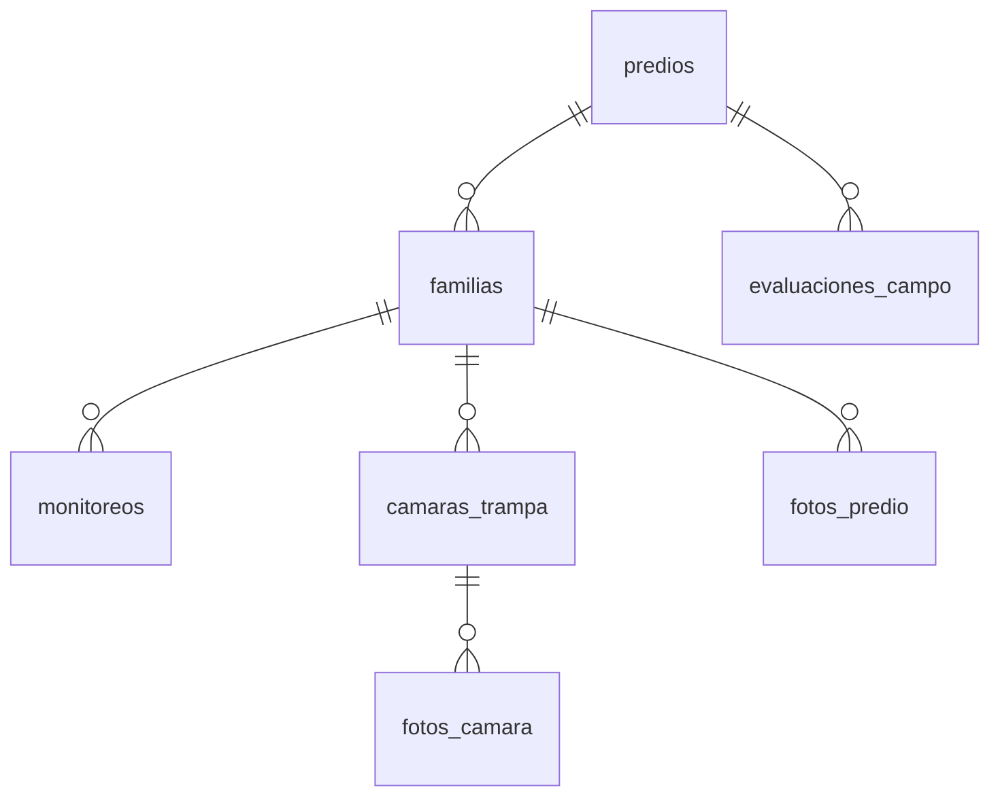
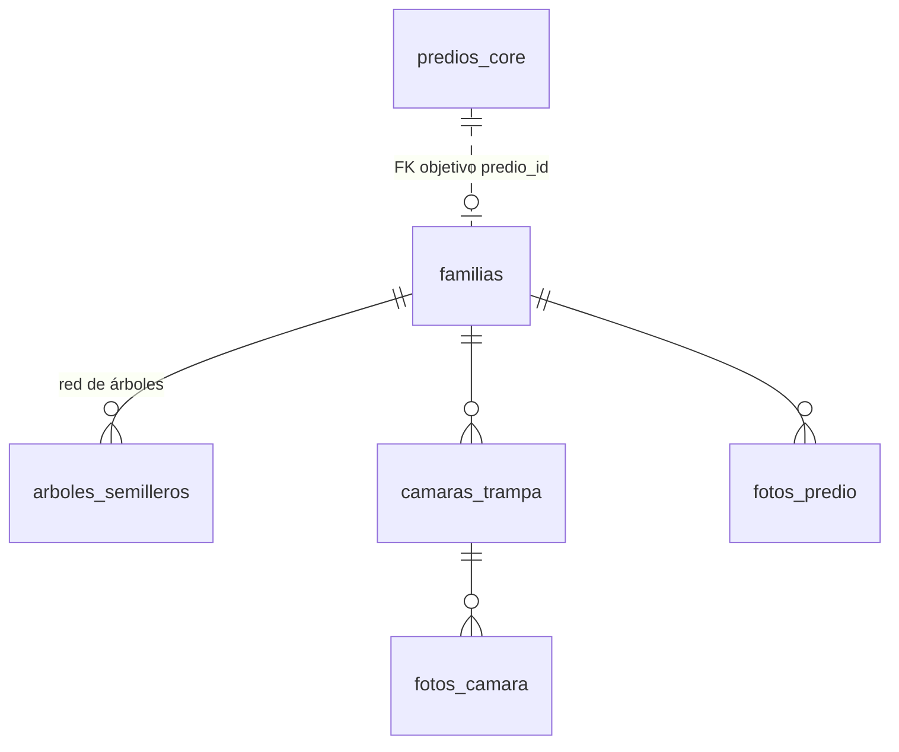
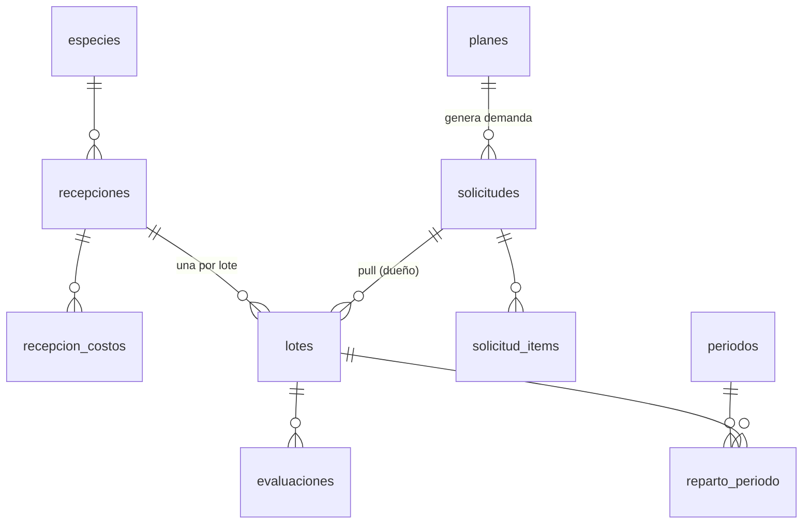

# Arquitectura de Datos — Amazonía Emprende

> **Documento maestro de entidad-relación y parámetros de TODO el ecosistema.** Consolida en un solo lugar: qué entidades existen, qué parámetros tiene cada una, sus llaves (PK/FK/UNIQUE) y cómo se relacionan. Base para **desarrollar masivamente**.
>
> **Fecha:** 2026-06-27 · Supabase: `lbxysovesmbgesxooghw`
> **Fuentes:** introspección real de producción ([`../SUPABASE_SCHEMAS.md`](../SUPABASE_SCHEMAS.md)) + parámetros de diseño de módulos por construir (antes en `parametros_ER.xlsx`, hoy aquí) + decisiones en [`ARQUITECTURA_ECOSISTEMA.md`](ARQUITECTURA_ECOSISTEMA.md).
>
> **Reemplaza** al Excel `parametros_ER.xlsx` y a los diagramas `.svg/.html` (eliminados 2026-06-27). Este `.md` es la **fuente de verdad viva**; los diagramas son Mermaid embebidos.

## Cómo leer el estado

| Marca | Significado |
|---|---|
| 🟢 | En producción (tabla creada y en uso real) |
| 🧪 | Existe pero son **datos de prueba**, no productivos (prueba de concepto exitosa) |
| 🔧 | Diseñado / parcialmente construido — falta completar |
| 🔴 | Por construir (no existe aún) |

**Llaves:** `PK` primaria · `FK→` foránea (apunta a) · `UQ` única (identificador natural).

---

## 1. Dos dominios + lo transversal

El sistema **no se fusiona** en un solo modelo (decisión D3 descartada, 2026-06-27). Son **dos dominios de negocio** que se apoyan en un **núcleo transversal compartido**.

```mermaid
flowchart TB
    subgraph CORE[Núcleo transversal compartido]
        AL[core.aliados]
        PR[core.predios]
        EX[core.expedientes]
        GEO[geo.zonas]
        CAT[catalogo.especies]
        AL --> PR --> EX
        PR --> GEO
    end

    subgraph SIE[Dominio · Siembra / Restauración &#40;PROCESO end-to-end&#41;]
        JUR[juridica.*] --> SIGI[SIG I · geo.zonas]
        SIGI --> CAMPO[siembra.* · evaluación/encuesta]
        CAMPO --> SIGII[SIG II · geo.zona_revision]
        SIGII --> PLAN[siembra.planes · receta×área]
        PLAN --> VIV[(vivero.* · producción)]
    end

    subgraph CONS[Dominio · Conservación / RAS]
        RF[ras.familias] --> RA[ras.arboles_semilleros]
        RF --> RC[ras.camaras_trampa]
    end

    subgraph ADMIN[Soporte · Administración]
        PEO[people.user_profiles]
        FLE[fleet.*]
        EJE[ejecutivo.*]
        PUB[public.*]
    end

    CORE --- SIE
    CORE --- CONS
    PLAN --> CAT
    RA --> CAT
```



- **Siembra (Restauración)** = el **proceso completo**: Jurídica → SIG I → Campo → SIG II → Plan → Vivero → Ejecución. Hoy `siembra.*` y la PWA de campo son **pruebas exitosas, no productivas**.
- **Conservación (RAS = Red de Árboles Semilleros)** = familias en conservación que **alojan** la red de árboles semilleros; el **árbol es la entidad central** (`ras.arboles_semilleros`, por construir).
- **Núcleo transversal** (`core`, `geo`, `catalogo`) lo comparten ambos. `catalogo.especies` es el maestro de especies que usan vivero, plan, ras y Ley del árbol.

> "RAS" tiene dos sentidos: en los diagramas del **proceso de restauración** = el equipo; como **schema/dominio** (`ras.*`) = Conservación / Red de Árboles Semilleros.

---

## 2. Núcleo transversal

### 2.1 `core` — persona / predio / proceso 🟢



**`core.aliados`** — persona natural o jurídica. 🟢
| Parámetro | Tipo | Llave | Notas |
|---|---|---|---|
| id | uuid | PK | |
| tipo_persona | text | | `natural` \| `juridica` |
| tipo_documento | text | | CC/NUIP/CE/TI/PP/NIT |
| numero_documento | text | UQ | identifica naturalmente a la persona |
| nombre_completo | text | | razón social si jurídica |
| telefono / email | text | | |
| created_by / created_at / updated_at | — | | auditoría |

**`core.predios`** — predio. 🟢
| Parámetro | Tipo | Llave | Notas |
|---|---|---|---|
| id | uuid | PK | |
| aliado_id | uuid | FK→ core.aliados | dueño principal (ON DELETE RESTRICT) |
| nombre_predio / departamento / municipio / vereda / zona_ae | text | | `zona_ae` ≈ núcleo |
| matricula_inmobiliaria | text | UQ parcial | la principal del englobe |
| matriculas | text[] | | varias matrículas (englobe) |
| codigo_catastral | text | | |
| area_registral | numeric(12,4) | | hectáreas del folio |

**`core.predio_propietarios`** — copropiedad N—N. 🟢
| Parámetro | Tipo | Llave | Notas |
|---|---|---|---|
| id | uuid | PK | |
| predio_id | uuid | FK→ core.predios | ON DELETE CASCADE |
| aliado_id | uuid | FK→ core.aliados | |
| rol | text | | `principal` \| `copropietario` |
| cuota_pct | numeric(5,2) | | opcional |

**`core.expedientes`** — máquina de estados del proceso (1 por predio). 🟢
| Parámetro | Tipo | Llave | Notas |
|---|---|---|---|
| id | uuid | PK | |
| predio_id | uuid | FK→ core.predios · UQ | 1 expediente por predio |
| etapa | text | | `juridica`→`sig_i`→`campo`→`sig_ii`→`plan`→`juridica_ii`→`ejecucion`→`archivado` |
| estado | text | | `activo` \| `rechazado` \| `archivado` \| `completado` |
| linea | text | | `restauracion` \| `conservacion` \| `ambas` |
| proyecto_fase / responsable | text | | |
| fecha_inicio | timestamptz | | |

### 2.2 `geo` — geoespacial (PostGIS) 🟢 (creado, vacío)

**`geo.zonas`** — geometría editable, fuente de verdad del área. 🟢
| Parámetro | Tipo | Llave | Notas |
|---|---|---|---|
| id | uuid | PK | |
| predio_id | uuid | FK→ core.predios | |
| tipo | text | | `finca` \| `restauracion` \| `conservacion` |
| estado | text | | `potencial`→`validada`→`definitiva`→`avalada` (versionado) |
| geom | geometry(MultiPolygon,4326) | | geometría real — índice GIST |
| area_ha | numeric | | `ST_Area(geom::geography)/10000` |
| perimetro_m | numeric | | |
| propiedades | jsonb | | atributos del shapefile origen |
| origen | text | | `sig` \| `campo` \| `ia` |
| shapefile_url | text | | `.zip` de respaldo (Storage) — opcional |
| version | integer | | versionado de la zona |
| created_at | timestamptz | | |

> RPCs: `geo.crear_zona(geojson)`, `geo.crear_zona_union(...)`, `geo.zonas_de_predio(predio_id)`. Migraciones v1/v2/v3 corridas.

**`geo.zona_revision`** — corrección de zonas en campo (SIG II). 🔧 diseñado
| Parámetro | Tipo | Llave | Notas |
|---|---|---|---|
| id | uuid | PK | |
| zona_id | uuid | FK→ geo.zonas | zona potencial que se corrige |
| confirmada | boolean | | ¿apta tras verla en terreno? |
| metodo | text | | `vertices` \| `gps` \| `nueva` |
| geom_corregida | geometry(MultiPolygon,4326) | | se vuelca a geo.zonas (estado `validada`) |
| area_ha_campo | numeric | | área real medida |
| observaciones / foto_url / evaluador | text | | |
| fecha | date | | |
| sync_origin | text | | `pwa` \| `web` (app offline) |

### 2.3 `catalogo` — maestro de especies 🔴 por construir

**`catalogo.especies`** — usado por vivero, plan, ras (árboles) y Ley del árbol.
| Parámetro | Tipo | Llave | Notas |
|---|---|---|---|
| id | uuid | PK | |
| nombre_comun / nombre_cientifico | text | | |
| familia | text | | familia botánica |
| tipo_almacenamiento | text CHECK | | `ortodoxa` \| `recalcitrante` \| `intermedia` |
| semillas_por_kg | numeric | | factor kg → nº semillas |
| pct_germinacion_esperado | numeric | | 0–100 |
| dias_germinacion_esperado | integer | | alerta de siembra |
| dias_crecimiento_vivero | integer | | alerta de siembra |
| precio_referencia_kg | numeric | | comparar contra costo real |
| rol_sucesional / habito | text | | para el Plan |
| aplica_ley_arbol | boolean | | |

---

## 3. Dominio Siembra / Restauración (el PROCESO)

> Cadena de valor end-to-end. **Estado:** `siembra.*` y la PWA de campo son 🧪 **prueba exitosa, no productiva**. El plan/vivero están 🔧/🔴. El detalle columna-a-columna de la encuesta socioeconómica vive en [`../SUPABASE_SCHEMAS.md`](../SUPABASE_SCHEMAS.md) (introspección de producción); aquí va el ER y las secciones.

### 3.1 Etapas del proceso

| Etapa | Produce | Lo consume | Entidad |
|---|---|---|---|
| Jurídica I | aliado/predio aprobado (semáforo) | SIG I | `core.*` + `juridica.*` |
| SIG I | zonas potenciales | Campo | `geo.zonas` (estado potencial) |
| Campo | evaluación biofísica + encuesta | SIG II / Plan | `siembra.evaluaciones_campo`, `siembra.familias` |
| SIG II | zonas corregidas + área (ha) | Plan | `geo.zona_revision` → `geo.zonas` |
| Plan | demanda de plántulas | Vivero | `siembra.planes` + `modelos_floristicos` + `plan_zonas` |
| Vivero | plántulas con costo | Ejecución | `vivero.*` |

### 3.2 `juridica` — debida diligencia (sobre `core`) 🟢

**`juridica.debida_diligencia`** — workflow + soportes (1:1 predio).
| Parámetro | Tipo | Llave | Notas |
|---|---|---|---|
| id | uuid | PK | |
| predio_id | uuid | FK→ core.predios · UQ | el `[id]` de la UI de jurídica = `predio_id` |
| estado | text | | `borrador`→`antecedentes_ok`→`juridico_ok`→`aprobado`\|`rechazado` |
| cedula_url / certificado_tradicion_url / recibo_predial_url / manifestacion_url | text | | PDF/imagen/Word en bucket `juridica-documentos` |
| anio_ultimo_pago_predial | integer | | |
| manifestacion_interes / manifestacion_observaciones | bool / text | | |

**`juridica.antecedentes`** — 14 listas restrictivas + PEP/prensa (1:1 por persona). FK `aliado_id`→`core.aliados`.
Banderas booleanas con `_url`: rama_judicial, procuraduria, contraloria, policia_nacional, rnmc, onu, ofac, bid, banco_mundial, hm_treasury, fbi, interpol, ue_terroristas, dea. Más: `pep`, `prensa_negativa`, `observaciones`, `aprobado`.

**`juridica.analisis_juridico`** — folio de matrícula + semáforo (1:1 predio). FK `predio_id`→`core.predios`.
Folios (fmi_matrices/derivados, acto_origen), banderas (falsa_tradicion, procesos_judiciales+desc, medidas_cautelares+desc, liquidaciones, sucesiones), conceptos ANT/URT/PNN, `semaforo` (verde/amarillo/naranja/rojo).

### 3.3 `siembra` — campo (evaluación + encuesta) 🧪 prueba



**`siembra.predios`** — predio registrado en campo (PWA). PK `id`; `predio_id` lógico; datos: local_id, nombre_predio, propietario, ubicación, fecha, contacto, num_zonas, sync_origin.

**`siembra.familias`** — encuesta socioeconómica completa (≈150 columnas). FK `predio_id`→siembra.predios, `aliado_id`→`core.aliados` (prellenado de jurídica). Secciones: Identificación · Metadatos encuesta · Predio · Hogar&Familia · Vivienda&Servicios · Salud&Educación · Economía · Ganadería (incl. regenerativa) · Tecnología&Manejo · Bosque&Ambiente · Restauración · Asociatividad · Archivos (shapefiles, acuerdo) · Snapshots `sec_*` JSONB. **Columnas completas en SUPABASE_SCHEMAS.md.**

**`siembra.evaluaciones_campo`** — formato AE-CAMPO-001. FK `predio_id`, `familia_id`. Grupos: Visita · Conectividad · Social · Vegetación · Suelo · Agua · Acceso · Riesgos · Fotos · Firmas · JSON. **Detalle en SUPABASE_SCHEMAS.md.**

**`siembra.monitoreos`** (id, familia_id FK, fecha, supervivencia_pct) · **`siembra.camaras_trampa`** (id, familia_id FK, nombre, lat, lon) · **`siembra.fotos_camara`** (id, camara_id FK, url) · **`siembra.fotos_predio`** (id, familia_id FK, categoria, url).

### 3.4 Plan de siembra 🔧 diseñado

```
ÁREA (geo.zonas.area_ha) × RECETA (densidad × %especie) × (1 + reposición) = DEMANDA → vivero
```

**`siembra.planes`** — plan del predio.
| Parámetro | Tipo | Llave | Notas |
|---|---|---|---|
| id | uuid | PK | |
| expediente_id | uuid | FK→ core.expedientes | |
| predio_id | uuid | FK→ core.predios | |
| estado | text | | `borrador`→`aprobado` |
| factor_reposicion_pct | numeric | | % por mortalidad (EDITABLE) |
| modelo_default_id | uuid | FK→ siembra.modelos_floristicos | caso 'por predio' |
| documentos_soporte_url / observaciones | text | | |

**`siembra.modelos_floristicos`** (id PK, nombre, densidad_plantulas_ha, arreglo, descripcion) — la receta.
**`siembra.modelo_especies`** (id PK, modelo_id FK, especie_id FK→catalogo.especies, porcentaje) — composición (suma 100%).
**`siembra.plan_zonas`** (id PK, plan_id FK, zona_id FK→geo.zonas ⭐ área del cálculo, modelo_id FK) — receta ↔ zona (caso 'por zona', recomendado).

---

## 4. Dominio Conservación / RAS (Red de Árboles Semilleros)

> El **árbol semillero es la entidad central**. Hoy `ras.familias` solo guarda conteos (`arboles_semilleros`, `especies_forestales`, en 0) + un `shapefile_arboles_url` (.zip); el geovisor dibuja puntos anónimos. **Rediseño:** el árbol pasa a tabla propia (`ras.arboles_semilleros`), el conteo se deriva, y el geovisor consulta la tabla. Tablas de árbol **separadas** de siembra (D3 descartada).



### 4.1 `ras.familias` — familia/predio anfitrión en conservación 🟢 (17 filas) · 🔧 en rediseño

Identificación: id PK, nombre_propietario, tipo/numero_documento, telefono, nucleo, departamento, municipio, vereda, nombre_finca.
Predio: ha_potreros/ha_bosque/ha_otras, distancia/tiempo_florencia.
Hogar: adultos, ninos, cant_mujeres/hombres, actividad_economica, empleos_locales, tiene_espacio_vegetal.
Conservación: bajo_conservacion, acuerdo_conservacion, num_individuos, num_especies_inventario, area_bosque_recorrida, otros_indices.
Archivos: shapefile_finca_url, shapefile_conservacion_url, documento_acuerdo_url.
Auditoría: created_by, created_at, updated_at.

**Cambios del rediseño:**
- `arboles_semilleros` / `especies_forestales` → **derivados** (`COUNT(*)` / `COUNT(DISTINCT especie)` de `ras.arboles_semilleros`), no campos a mano.
- `shapefile_arboles_url` → **deja de ser la fuente**; los árboles viven en la tabla nueva (el .zip queda como respaldo).
- Pendiente: `aliado_id` / `expediente_id` opcionales → `core` (conectar conservación al núcleo).
- Bloque socioeconómico pesado heredado de siembra: **aligerar/colapsar** (decisión pendiente).

### 4.2 `ras.arboles_semilleros` — la red de árboles 🔴 POR CONSTRUIR (entidad central)

> Unifica las 3 "tablas" de la profesional: **Botánica** (determinación taxonómica), **Solano/Tablas-RAS** (formulario Kobo: dendrometría + geo + monitoreo dron). Llave natural `(nucleo, predio, codigo_arbol)`.

| Parámetro | Tipo | Llave | Origen CSV | Notas |
|---|---|---|---|---|
| id | uuid | PK | | |
| familia_id | uuid | FK→ ras.familias | | nulo si el predio aún no es familia (ej. Solano) |
| especie_id | uuid | FK→ catalogo.especies | | enlaza al maestro (cuando exista) |
| nucleo | text | | todos | denormalizado |
| predio | text | | todos | denormalizado (texto, para no-familias) |
| codigo_arbol | text | UQ(nucleo,predio,codigo) | todos | |
| **— Taxonomía —** | | | | |
| nombre_comun | text | | todos | nombre común actualizado |
| nombre_comun_antiguo | text | | Kobo | lo que se creía en campo |
| genero / epiteto | text | | Botánica | |
| nombre_cientifico | text | | todos | determinado |
| familia_botanica | text | | todos | |
| especie_anterior | text | | Botánica | determinación previa |
| colecta | text | | Botánica | voucher (ej. "LR 1516") |
| referencia_antigua | text | | Kobo | |
| **— Dendrometría/sitio —** | | | | |
| cobertura_vegetal / pendiente / drenaje / tipo_suelo / forma_fuste | text | | Kobo | |
| cap_cm / dap_cm / ab_m2 | numeric | | Kobo | circunferencia/diámetro/área basal |
| altura_comercial_m / altura_total_m | numeric | | Kobo | |
| clasificacion_copa | text | | Kobo | dominante/codominante/intermedio |
| copa_x_m / copa_y_m | numeric | | Kobo | |
| especies_asociadas | text | | Kobo | |
| **— Geo —** | | | | |
| latitud / longitud | numeric | | Kobo | punto para el geovisor |
| x / y | numeric | | Kobo | coords proyectadas (opcional) |
| **— Monitoreo dron —** | | | | |
| monitoreo_dron | boolean | | RAS | |
| razon_no_dron | text | | RAS | |
| metodo_colecta / metodo_trepa / trepa_arbol | text | | RAS | |
| ruta_dron / codigo_dron | text | | RAS | |
| **— Registro —** | | | | |
| fecha_registro | date | | Kobo | |
| foto_url | text | | Kobo | foto del árbol (Storage / KoboToolbox) |
| origen | text | | Kobo | `kobo` \| `manual` \| `csv` |
| nombre_registra | text | | Kobo | |
| estado_verificacion | text | | Kobo | `campo` → `verificado` (2ª pasada botánica) |
| observaciones | text | | todos | |
| created_at | timestamptz | | | |

**Ingreso de datos:** carga masiva por predio (CSV Kobo, encoding `windows-1252`, sep `;`) + edición/corrección manual en la intranet + (futuro) sync directo KoboToolbox API.
**Visualización:** intranet (tabla + mini-mapa + métricas derivadas por predio) y geovisor (punto con popup real: código, común+científico, familia, DAP, foto; clúster; filtro por especie/familia).

### 4.3 `ras.camaras_trampa` / `ras.fotos_camara` / `ras.fotos_predio` / `ras.monitoreos`
Misma estructura que sus homólogos en `siembra` (id, familia_id FK, …). Actualmente sin filas.

---

## 5. Dominio Vivero (autónomo, app aparte) 🔴 por construir

> Producción **bajo demanda (pull)**. Costeo: el costo del lote se mantiene pese a la mortalidad (lo absorben las normales); corte mensual repartido por días-plántula. Spec: `app_vivero/CONTEXTO_MODULO_VIVERO.md`.



**`vivero.recepciones`** (id PK, especie_id FK→catalogo, fecha, origen CHECK, cantidad_kg, proveedor, procedencia, estado CHECK).
**`vivero.recepcion_costos`** (id PK, recepcion_id FK, tipo CHECK `adquisicion`(volátil)/transporte/operativo/administrativo, monto, fecha).
**`vivero.lotes`** (id PK, recepcion_id FK, especie_id FK, solicitud_id FK ⭐pull, fecha_siembra, cantidad_kg_usados, semillas_sembradas, estado CHECK, fecha_listo/fecha_fin).
**`vivero.evaluaciones`** (id PK, lote_id FK, fecha, normales⭐divisor del costo, anomalas/muertas/duras/frescas).
**`vivero.periodos`** (id PK, nombre ej "2026-06", costo_total_indirecto, estado CHECK) · **`vivero.reparto_periodo`** (id PK, periodo_id FK, lote_id FK, dias_plantula, costo_asignado).
**`vivero.solicitudes`** (id PK, plan_id FK→siembra.planes, fecha_requerida, estado CHECK) · **`vivero.solicitud_items`** (id PK, solicitud_id FK, especie_id FK, cantidad_requerida/entregada).

---

## 6. Soporte / Administración 🟢

- **`people.user_profiles`** (id PK, email UQ, full_name, role, department `RAS`/`Ejecutivo`/`Financiero`, is_admin, can_access_intranet, last_login). Trigger desde `auth.users`.
- **`fleet.vehicle_reservations`** · **`fleet.vehicle_inspections`** (reservation_id FK, cat1..6_status/issues/other, fotos) · **`fleet.vehicle_documents`** (soat/tecno_expiry).
- **`ejecutivo.sesiones`** (iniciado_por/ejecutivo_id/persona_id FK→people) · **`ejecutivo.indicaciones`** (sesion_id FK, bloque, estado, nota).
- **`public.consentimientos`** (tratamiento de datos) · **`public.proyecciones`** (metas por fase I/II/III).

---

## 7. Mapa completo de relaciones (FK)

| Desde | → Hacia | Card. | Dominio |
|---|---|---|---|
| core.predios.aliado_id | core.aliados.id | N:1 | núcleo |
| core.predio_propietarios.predio_id | core.predios.id | N:1 | núcleo |
| core.predio_propietarios.aliado_id | core.aliados.id | N:1 | núcleo |
| core.expedientes.predio_id | core.predios.id | 1:1 | núcleo |
| geo.zonas.predio_id | core.predios.id | N:1 | geo |
| geo.zona_revision.zona_id | geo.zonas.id | N:1 | geo |
| juridica.debida_diligencia.predio_id | core.predios.id | 1:1 | siembra |
| juridica.antecedentes.aliado_id | core.aliados.id | 1:1 | siembra |
| juridica.analisis_juridico.predio_id | core.predios.id | 1:1 | siembra |
| siembra.familias.predio_id | siembra.predios.id | N:1 | siembra 🧪 |
| siembra.familias.aliado_id | core.aliados.id | N:1 | siembra 🧪 |
| siembra.evaluaciones_campo.predio_id | siembra.predios.id | N:1 | siembra 🧪 |
| siembra.fotos_predio.familia_id | siembra.familias.id | N:1 | siembra 🧪 |
| siembra.planes.expediente_id | core.expedientes.id | N:1 | siembra 🔧 |
| siembra.planes.predio_id | core.predios.id | N:1 | siembra 🔧 |
| siembra.modelo_especies.modelo_id | siembra.modelos_floristicos.id | N:1 | siembra 🔧 |
| siembra.modelo_especies.especie_id | catalogo.especies.id | N:1 | siembra 🔧 |
| siembra.plan_zonas.plan_id | siembra.planes.id | N:1 | siembra 🔧 |
| siembra.plan_zonas.zona_id | geo.zonas.id | N:1 | siembra 🔧 ⭐área |
| ras.arboles_semilleros.familia_id | ras.familias.id | N:1 | conservación 🔴 |
| ras.arboles_semilleros.especie_id | catalogo.especies.id | N:1 | conservación 🔴 |
| ras.camaras_trampa.familia_id | ras.familias.id | N:1 | conservación |
| ras.fotos_camara.camara_id | ras.camaras_trampa.id | N:1 | conservación |
| vivero.recepciones.especie_id | catalogo.especies.id | N:1 | vivero 🔴 |
| vivero.recepcion_costos.recepcion_id | vivero.recepciones.id | N:1 | vivero 🔴 |
| vivero.lotes.recepcion_id | vivero.recepciones.id | N:1 | vivero 🔴 |
| vivero.lotes.solicitud_id | vivero.solicitudes.id | N:1 | vivero 🔴 pull |
| vivero.lotes.especie_id | catalogo.especies.id | N:1 | vivero 🔴 |
| vivero.evaluaciones.lote_id | vivero.lotes.id | N:1 | vivero 🔴 |
| vivero.reparto_periodo.periodo_id | vivero.periodos.id | N:1 | vivero 🔴 |
| vivero.reparto_periodo.lote_id | vivero.lotes.id | N:1 | vivero 🔴 |
| vivero.solicitudes.plan_id | siembra.planes.id | N:1 | vivero 🔴 |
| vivero.solicitud_items.solicitud_id | vivero.solicitudes.id | N:1 | vivero 🔴 |
| vivero.solicitud_items.especie_id | catalogo.especies.id | N:1 | vivero 🔴 |

---

## 8. Estado por entidad y orden para desarrollar masivamente

| Schema / tabla | Estado | Acción |
|---|---|---|
| core.* (aliados/predios/propietarios/expedientes) | 🟢 | — |
| juridica.* (debida_diligencia/antecedentes/analisis_juridico) | 🟢 | — |
| people / fleet / ejecutivo / public | 🟢 | — |
| geo.zonas (+ RPCs) | 🟢 vacío | probar con shapefile real |
| geo.zona_revision | 🔧 | construir (Campo SIG II) |
| **catalogo.especies** | 🔴 | **fundación — desbloquea plan, vivero, ras-árboles** |
| siembra.* (predios/familias/evaluaciones/…) | 🧪 prueba | rehacer al llegar la etapa Campo |
| siembra.planes / modelos / modelo_especies / plan_zonas | 🔧 | construir tras geo + catálogo |
| vivero.* (8 tablas) | 🔴 | app aparte; tras catálogo + plan |
| ras.familias | 🟢/🔧 | rediseñar formulario (aligerar + derivar conteos) |
| **ras.arboles_semilleros** | 🔴 | **construir: tabla + carga CSV/Kobo + geovisor** |
| ras.camaras_trampa / fotos_* / monitoreos | 🟢 vacío | — |

**Secuencia recomendada para construir en bloque:**
1. **`catalogo.especies`** — maestro que comparten conservación (árboles), plan y vivero. Es la fundación.
2. **`ras.arboles_semilleros`** + rediseño del formulario de conservación + conexión al geovisor (dominio Conservación, prioridad actual).
3. **Plan de siembra** (`siembra.planes`/modelos/plan_zonas) sobre `geo.zonas` + catálogo.
4. **Vivero** (`vivero.*`) — app aparte, recibe la demanda del plan (pull).
5. **`geo.zona_revision`** (Campo SIG II) + conexión de conservación al `core`.

> SQL de cada bloque: `docs/sql/`. No se ejecuta DDL desde el asistente; las migraciones las corre el usuario en el SQL Editor.
