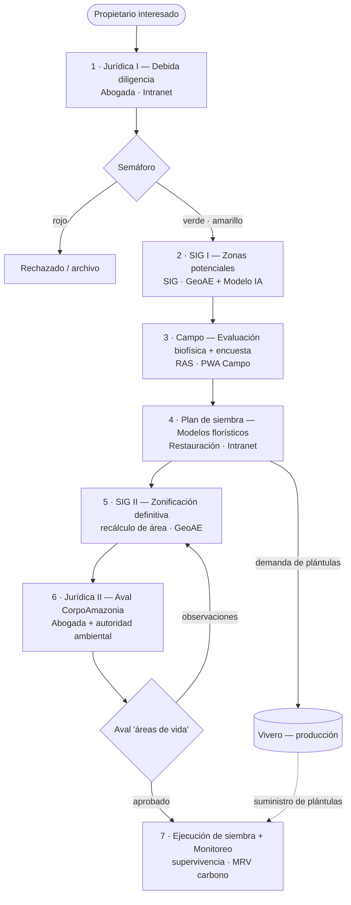
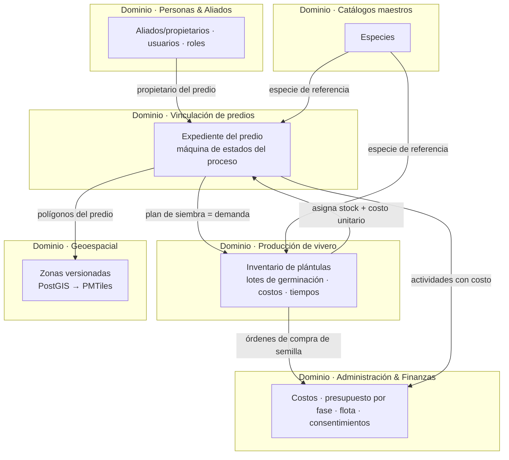
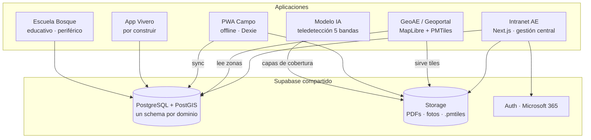
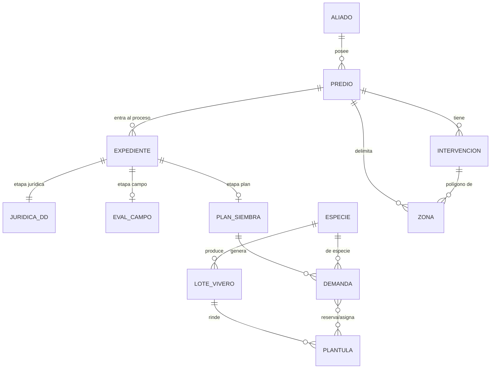
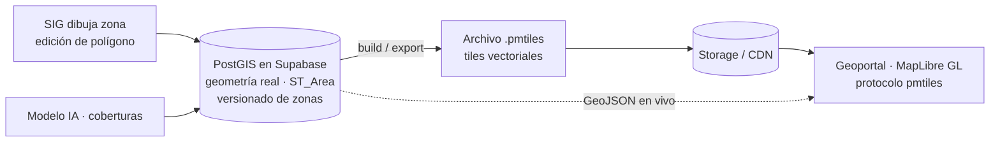

# Arquitectura del Ecosistema — Amazonía Emprende

> **Documento maestro de arquitectura.** Versión 0.1 — borrador para discusión.
> **Fecha:** 2026-06-09
> **Complementa:** [`ECOSISTEMA_PROYECTOS.md`](ECOSISTEMA_PROYECTOS.md) (mapa de proyectos) · [`../SUPABASE_SCHEMAS.md`](../SUPABASE_SCHEMAS.md) (datos actuales) · [`INTRANET_DESCRIPCION.md`](INTRANET_DESCRIPCION.md) (funcional)
>
> **Cómo leer el estado:** 🟢 = refleja el proceso/realidad actual · 🟡 = propuesta con **decisiones abiertas** (ver §7).

---

## 0. Por qué este documento y cómo está organizado

El sistema se construyó **módulo por módulo** (flota, jurídica, RAS, ejecutivo…). El proceso real del negocio, en cambio, es **de extremo a extremo**: un predio avanza por una cadena de etapas con responsables y compuertas. Este documento alinea ambas cosas.

> **Dos dominios — no mezclar.**
> **(1) Siembra (Restauración)** = el proceso completo de extremo a extremo (Jurídica → SIG I → Campo → SIG II → Vivero → Ejecución), descrito en las §1–§7. No es un módulo de "familias". Hoy `siembra.*` y la PWA de campo son **pruebas exitosas, no datos productivos**.
> **(2) Conservación (RAS = Red de Árboles Semilleros)** = dominio aparte (`ras.*`): familias en conservación que alojan la red de árboles semilleros, donde el **árbol es la entidad principal** (uno por fila). Está en rediseño y **no comparte tablas ni flujo** con Siembra.
> Ojo con "RAS": en los diagramas del proceso es el **equipo** de algunas etapas; como schema/dominio significa **Conservación**.

**Regla de oro:** no existe *un solo diagrama* que explique todo. Usamos **cuatro vistas**, cada una responde una pregunta distinta. Juntas, son la arquitectura.

| # | Vista | Pregunta que responde |
|---|-------|----------------------|
| 1 | **Proceso** | ¿Qué ocurre, quién lo hace y en qué orden? ¿Dónde están las compuertas? |
| 2 | **Dominios** | ¿Cuáles son los "territorios" del sistema y cómo se conectan entre sí? |
| 3 | **Aplicaciones** | ¿Qué app hace qué, sobre qué datos? |
| 4 | **Datos** | ¿Cómo modelamos sin duplicar información? |

---

## 1. Vista de Proceso — la cadena de valor 🟢

Un predio interesado recorre esta cadena. Cada etapa produce un **entregable** y termina en una **compuerta** (rombo) que decide si avanza.

### Tabla de etapas

| # | Etapa | Responsable | Entrada | Entregable | App | Compuerta |
|---|-------|-------------|---------|-----------|-----|-----------|
| 1 | Jurídica I · Debida diligencia | Abogada | Manifestación de interés | Aliado con semáforo | Intranet `/juridica` | 🚦 verde/amarillo continúa; rojo se archiva |
| 2 | SIG I · Zonas potenciales | Equipo SIG | Predio aprobado | Polígonos candidatos de restauración | GeoAE + Modelo IA | Existe ≥1 zona potencial |
| 3 | Campo · Evaluación | RAS | Zonas potenciales | Evaluación biofísica (AE-CAMPO-001) + encuesta socioeconómica | PWA Campo | Datos completos y validados en terreno |
| 4 | Plan de siembra | Restauración | Evaluación de campo | Modelo florístico + demanda de plántulas | Intranet (módulo nuevo) | Plan aprobado técnicamente |
| 5 | SIG II · Zonificación definitiva | Equipo SIG | Plan de siembra | Polígonos ajustados + área efectiva (ha) | GeoAE | Área recalculada y cerrada |
| 6 | Jurídica II · Aval | Abogada + CorpoAmazonia | Zonas definitivas | Aval "áreas de vida" / Ley del árbol | Intranet `/juridica` | Aval otorgado |
| 7 | Ejecución + Monitoreo | RAS + Vivero | Aval | Siembra ejecutada, supervivencia, MRV | Intranet + PWA | (ciclo de monitoreo continuo) |

**Salidas del proceso (líneas de producto sobre el mismo predio):** Ley del árbol · Bonos de carbono · Conservación (RAS).

> **Nota:** las etapas 2 y 5 son **el mismo dominio geoespacial en dos momentos** (zonas *potenciales* antes de campo; zonas *definitivas/avaladas* después del plan). Por eso las zonas deben ser **versionadas** (§5).

---

## 2. Vista de Dominios 🟡

El sistema **no tiene una sola columna vertebral**. Tiene varios **dominios** (territorios con su propia lógica) que se conectan por **interfaces** explícitas. El *expediente* es la columna de **un** dominio (la vinculación del predio), no del sistema entero. El **vivero** es autónomo: produce de forma anticipada y se conecta al pipeline por una interfaz de **demanda/suministro**, no por pertenencia.

### Por qué separar así

- **Vinculación (Expediente):** el único dominio con orden estricto (jurídica → campo → aval). Aquí sí hay máquina de estados.
- **Vivero:** lógica de **inventario/manufactura**, no de caso. Produce sin expediente; el expediente solo *consume*. Si lo forzáramos a colgar del expediente, no podríamos comprar semilla ni germinar por adelantado.
- **Geoespacial:** transversal. Sirve a SIG I y SIG II y publica al geoportal.
- **Catálogos (Especies):** dato maestro que hoy aparece suelto en 4 lugares; debe ser único y referenciado por todos.
- **Personas & Aliados:** identidad. Hoy duplicada (§4).
- **Administración & Finanzas:** el "pegamento" de costos; conecta vivero (compras) y expediente (actividades) con el presupuesto por fase.

---

## 3. Vista de Aplicaciones (contenedores) 🟢

Las apps comparten un único Supabase (`lbxysovesmbgesxooghw`). Cada una atiende uno o varios dominios.

| App | Carpeta | Dominios que atiende | Estado |
|-----|---------|----------------------|--------|
| Intranet AE | `Intranet-AE/` | Vinculación, Finanzas, Personas, (futuro: Plan, Vivero) | Producción |
| Geoportal | `GeoAE/` | Geoespacial (entrega) | Producción (visor) → evolucionar a PMTiles |
| PWA Campo | `familias-res/` | Siembra (etapa campo) | **Prueba exitosa — no productiva** (se rehará al llegar la etapa Campo) |
| App Vivero | `app_vivero/` | Producción de vivero | **Solo Excel — por construir** |
| Modelo IA | `modelo-web/` | Geoespacial (insumo SIG I) | Prototipo desconectado |
| Escuela Bosque | `amazonia-escuela-bosque/` | Educación | En desarrollo |

---

## 4. Vista de Datos — modelo canónico 🟢 *(implementado para jurídica · 2026-06-19)*

**Problema actual:** los datos del propietario y del predio se **copian** en `juridica.aliados`, `siembra.familias`, `siembra.predios` y `ras.familias`. Existe un único puente (`siembra.familias.aliado_id`), pero no normalización. Además, `juridica.aliados` **mezcla persona + predio** en una fila.

**Propuesta:** un núcleo canónico donde *persona*, *predio* e *intervención* son entidades separadas, y los módulos **referencian** en vez de recopiar.

### Cambios estructurales que implica

| Hoy | Propuesta canónica | Beneficio |
|-----|--------------------|-----------|
| Persona+predio mezclados en `juridica.aliados` | `core.aliados` (persona) **1—N** `core.predios` | Un propietario con varios predios; copropiedad posible |
| Datos copiados en 4 tablas | Las demás tablas guardan `predio_id` y **referencian** | Sin divergencia de datos |
| `siembra.*` y `ras.*` **se mantienen separados** (dominios distintos, decisión del usuario 2026-06-27) | NO se fusionan en `intervenciones`; cada dominio evoluciona aparte | Claridad de dominios; Siembra = proceso de restauración, RAS = conservación |
| Estado del proceso disperso | `core.expedientes` + `core.transiciones` (máquina de estados) | "¿En qué etapa está el predio X y quién tiene la pelota?" |
| "Especie" como número suelto | `catalogo.especies` referenciado por todos | Vivero, plan, campo y Ley del árbol hablan el mismo idioma |

> **Hecho (2026-06-19):** el modelo `core` está creado y **jurídica ya escribe sobre él** (cutover completo, verificado con un caso real). `core.aliados` (persona, natural/jurídica) **1—N** `core.predios` + `core.predio_propietarios` (copropiedad N—N) + `core.expedientes` (máquina de estados: juridica→sig→campo→…). Jurídica se descompuso en `juridica.debida_diligencia` (1:1 predio), `antecedentes` (por persona) y `analisis_juridico` (por predio). La tabla vieja se archivó y luego se borró. Cómo está hecho: [`CORE_MIGRACION.md`](CORE_MIGRACION.md).
>
> **Falta del modelo:** conectar conservación (`ras`) al `core` y construir `catalogo.especies`/vivero. `siembra` y `ras` **se mantienen como dominios separados** (D3 descartada, ver §7). No hay que migrarlo todo de golpe; el destino ya está decidido (ver §7).

---

## 5. Capa geoespacial — PostGIS (verdad) → PMTiles (entrega) 🟡

PMTiles y PostGIS **no compiten**: son capas distintas del mismo pipeline.

- **PostGIS** = fuente de verdad editable: aquí se calculan hectáreas reales, intersecciones y se **versiona** la zona (`potencial → validada → avalada`). Resuelve que hoy los polígonos son `.zip` en Storage y no se pueden medir.
- **PMTiles** = entrega serverless: un solo archivo de tiles servido por *range-requests*, sin servidor de tiles, render con MapLibre. Es el "ir al frente" del geoportal.
- **Puente:** un *build* compila las capas publicables de PostGIS a `.pmtiles`. Las capas en edición se sirven como GeoJSON directo.

| Estado de zona | Quién la fija | Momento en el proceso |
|----------------|---------------|----------------------|
| `potencial` | SIG + Modelo IA | Etapa 2 (SIG I) |
| `validada` | RAS en campo | Etapa 3 (Campo) |
| `definitiva` | SIG tras plan | Etapa 5 (SIG II) |
| `avalada` | CorpoAmazonia | Etapa 6 (Jurídica II) |

---

## 6. Parámetros generales por dominio 🟡

A alto nivel (no exhaustivo — el detalle de cada campo va en la spec de cada módulo).

| Dominio | Parámetros / variables generales |
|---------|----------------------------------|
| **Vinculación / Expediente** | etapa actual, responsable, fechas de transición, línea (restauración/conservación), proyecto-fase |
| **Jurídica** | semáforo (4 colores), 14 listas restrictivas, PEP, estado del folio, banderas jurídicas, documentos PDF |
| **Campo** | biofísicas (suelo, agua, vegetación, pendiente, riesgos) + socioeconómicas (hogar, economía, ganadería) + zonas evaluadas |
| **Plan de siembra** (interfaz) | modelo florístico (especie × densidad × arreglo), demanda por especie, fecha objetivo de siembra |
| **Vivero** (producción) | lote de semilla (procedencia, costo, fecha) · tanda de germinación (cantidad, mortalidad, tiempo) · plántula (especie, estado, costo unitario, lista-para-campo) |
| **Geoespacial** | zona (tipo, geometría, área ha, versión, estado), capa, fuente, fecha |
| **Catálogo de especies** | nombre científico/común, familia, hábito, rol sucesional, uso, ¿aplica Ley del árbol? |
| **Administración & Finanzas** | costo por actividad, presupuesto por fase, órdenes de compra, consentimientos de datos |

---

## 7. Decisiones (estado)

**Cerradas (2026-06-19):** **D1 → (a)** expediente adoptado (`core.expedientes`, máquina de estados por predio). **D2 → modelo canónico `core`** construido directamente (los datos de jurídica/siembra/ras eran de prueba, así que no hubo migración gradual: se levantó `core` limpio y jurídica escribe ahí). **D5 → (b)** vivero como app aparte. **D3 → DESCARTADA (2026-06-27): NO se fusionan `siembra`+`ras`.** Son dominios separados (Siembra = proceso de restauración; RAS = conservación / Red de Árboles Semilleros). **Sigue:** **D4** (PostGIS+PMTiles) confirmada pero pendiente de implementar (Fase 2).

| # | Decisión | Opciones | Impacto |
|---|----------|----------|---------|
| D1 | Alcance del **expediente** | (a) columna solo del dominio de vinculación *(recomendado)* · (b) no usarlo, conectar módulos con FKs sueltas | Define si hay tablero de "¿en qué etapa va cada predio?" |
| D2 | **Unificar aliado/predio** | (a) refactor del modelo actual · (b) capa canónica nueva que convive y migra gradual *(recomendado para no romper producción)* | Elimina duplicación; afecta jurídica, siembra, ras, PWA |
| D3 | **Fusionar `siembra`+`ras`** en `intervenciones` | ❌ **DESCARTADA (2026-06-27): se mantienen separados** (dominios distintos) | Claridad de dominios sobre dedup |
| D4 | **PostGIS + PMTiles** | confirmado: PostGIS como fuente, PMTiles como entrega | Habilita cálculo de área real y geoportal serverless |
| D5 | **App Vivero** | (a) módulo dentro de Intranet · (b) app aparte que sincroniza | Velocidad vs. separación de responsabilidades |

---

## 8. Recomendación de método y próximos pasos

1. **Validar este documento como marco compartido** (las 4 vistas + las decisiones §7).
2. **Cerrar D1–D5** — son las "vigas maestras"; todo lo demás se apoya en ellas.
3. **Profundizar dominio por dominio**, escribiendo una spec por dominio (como ya existe para jurídica en `juridica/CONTEXTO_MODULO_JURIDICO.md`). Orden sugerido por urgencia:
   - **Vivero** (está en cero y es el más grande) → modelo de inventario + interfaz de demanda.
   - **Catálogo de especies** (barato y desbloquea vivero y plan).
   - **Expediente** (da el tablero del proceso).
   - **Geoespacial** (PostGIS + PMTiles).
4. **Mantener este `.md` como fuente de verdad viva** — los diagramas Mermaid se editan como texto y renderizan en GitHub/VSCode.
