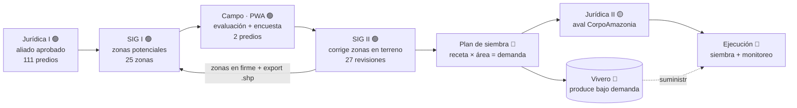
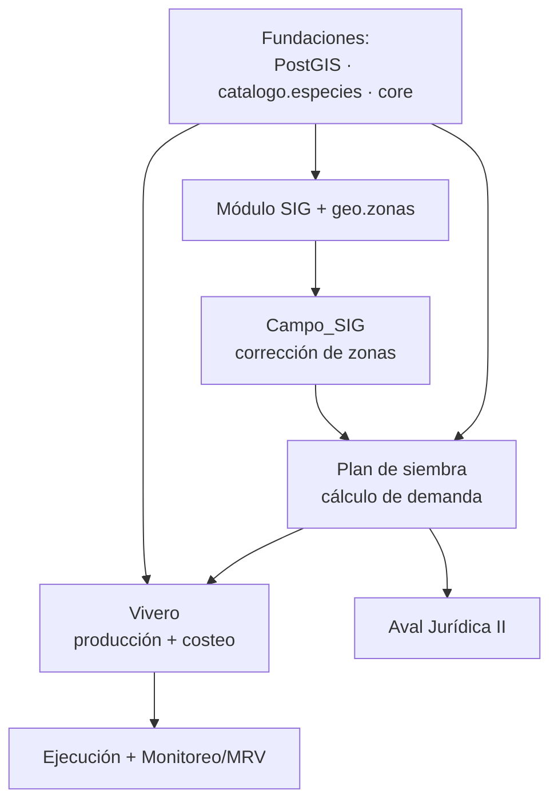

# Articulación y Proyección — Amazonía Emprende

> **Para qué este documento:** consolidar, antes de implementar, **cómo se articulan todos los componentes** que hemos diseñado y **qué queremos desarrollar** (la proyección). Es la memoria viva del diseño: si algo se olvida, se recupera aquí.
>
> **Fecha:** 2026-06-14 · **Documento maestro:** [`ARQUITECTURA_ECOSISTEMA.md`](ARQUITECTURA_ECOSISTEMA.md) · **Backlog:** [`PENDIENTES_INTEGRACION.md`](PENDIENTES_INTEGRACION.md)

---

## 0. Alcance: dos dominios separados

Este documento describe el dominio de **Siembra (Restauración)**. Hay un segundo dominio que **no se mezcla** con éste:

| | **Siembra (Restauración)** | **Conservación (RAS = Red de Árboles Semilleros)** |
|---|---|---|
| Qué es | El **proceso completo** de extremo a extremo | Familias en conservación que **alojan** la red de árboles semilleros |
| Flujo | Jurídica → SIG I → Campo → SIG II → Vivero → Ejecución | Registro del predio + su red de árboles (uno por árbol) |
| Objeto central | El **predio** avanzando por el expediente | El **árbol semillero** (uno por fila, colgado del predio) |
| Schemas | `core`, `geo`, `siembra.*`, `catalogo`, `vivero` | `ras.*` |
| Estado | La PWA de campo productiva es **`app_campo/`** (reconectada a `core`/`geo` desde 2026-07-08; `familias-res/` fue la prueba de concepto). Los **datos** de `siembra.*` siguen siendo de prueba, NO productivos. Producción real arranca con Jurídica sobre `core`. | En **rediseño**: parámetros del formulario + carga de árboles + conexión al geovisor |

> "Siembra" **no** es un módulo de familias: es la cadena de valor de la restauración completa. Lo que sigue (§1–§6) es ese proceso.

---

## 1. La articulación — el hilo de datos del predio

Un predio recorre el sistema de extremo a extremo. Cada componente **produce** algo que es la **entrada** del siguiente. Esa es la articulación.

> **Versión gráfica, con el estado real de cada etapa:** [`flujo-trabajo.html`](flujo-trabajo.html).



> **Ojo con el nombre:** lo que antes se llamaba "Campo_SIG" **es** el SIG II. No son dos etapas
> distintas: el mismo evaluador, en el mismo dispositivo y en la misma visita, primero llena la
> evaluación (Campo) y después corrige las zonas sobre el mapa satelital (SIG II).

| Etapa | Produce | Lo consume |
|-------|---------|-----------|
| Jurídica I | Aliado aprobado (semáforo) | SIG I / Campo (prellena la encuesta) |
| SIG I | Zonas **potenciales** (`geo.zonas`, estado=potencial) | Campo_SIG |
| Campo | Evaluación biofísica + encuesta (`siembra.evaluaciones_campo`, `familias`) | Plan |
| **Campo_SIG** | Zonas **corregidas en terreno** (`geo.zona_revision`) | SIG II |
| SIG II | Zonas **definitivas** con su **área (ha)** | **Plan (el cálculo)** |
| **Plan** | **Demanda de plántulas** por especie | **Vivero** (solicitud) + Jurídica II |
| Vivero | Plántulas con costo real | Ejecución |
| Jurídica II | Aval "áreas de vida" | Ejecución |
| Ejecución | Siembra + monitoreo (supervivencia, MRV) | Productos: Ley del árbol · Carbono · Conservación |

**Las "costuras" (claves foráneas) que cosen todo:**
- `core.predios.aliado_id` — separa persona de predio. **✅ implementado (2026-06-19)**
- `core.expedientes.predio_id` — el hilo del proceso colgando del predio. **✅ implementado**
- `geo.zonas.predio_id` — las zonas pertenecen al predio.
- `plan_zonas.zona_id` → `geo.zonas` — ⭐ **correlación terreno ↔ plan** (de aquí sale el área).
- `modelo_especies.especie_id` → `catalogo.especies` — la receta usa el catálogo.
- `solicitudes.plan_id` → `siembra.planes` — ⭐ **el plan genera la demanda del vivero** (pull).

---

## 2. El eje productivo: terreno → plan → vivero (el corazón)

Es la parte que más diseñamos. El **Plan de siembra** es el cerebro que conecta lo geoespacial con la producción:

```
ÁREA (de SIG)   ×   RECETA (modelo florístico)   ×   (1 + % reposición)   =   DEMANDA
geo.zonas.area_ha    densidad/ha × composición %       editable por plan        al vivero
```

- **El área** sale de las zonas (`geo.zonas`). Con **SIG I** = estimado preliminar (anticipa la compra de semilla); con **SIG II** = demanda en firme.
- **La receta** (`siembra.modelos_floristicos` + `modelo_especies`): densidad (plántulas/ha) y composición en **%** de especies del catálogo. Se asigna **por zona** (recomendado) o **por predio**.
- **La reposición** (`siembra.planes.factor_reposicion_pct`): margen por mortalidad, **editable**. Es lo que vuelve "aproximada" la cifra y conecta con la merma del vivero.
- **La salida**: el sistema arma el **borrador** de `vivero.solicitudes` + `solicitud_items`; la persona ajusta y al aprobar el plan, la solicitud queda en firme (**modelo pull**: cada plántula con dueño).

---

## 3. Qué queremos desarrollar

| Componente | Estado | Qué falta | Depende de |
|-----------|--------|-----------|-----------|
| Intranet (flota, ejecutivo) | 🟢 producción | — | — |
| Jurídica | 🟢 producción | Sobre `core`; subida de PDF/imagen/Word ✅ | `core` |
| App de campo (encuesta/evaluación) | 🧪 prueba exitosa, **no productiva** | Se rehará conectada al `core.expedientes` cuando arranque la etapa Campo | `core` |
| Conservación / RAS (familias + Red de Árboles Semilleros) | 🔧 en rediseño | Árbol como entidad propia; carga + geovisor | `ras` (dominio aparte) |
| **`catalogo.especies`** | 🔴 por construir | Crear schema maestro | — |
| **`core` (aliados/predios/expedientes)** | 🟢 implementado | Conectar campo/siembra y conservación | — |
| **PostGIS + `geo.zonas`** | 🔴 por construir | `CREATE EXTENSION` + modelo | — |
| **Módulo SIG (intranet)** | 🔴 por construir | Ingesta de geometría + PMTiles | PostGIS |
| **Campo_SIG (corrección de zonas)** | 🔧 en diseño | Edición de polígonos offline | geo.zonas + mapa PMTiles offline |
| **Plan de siembra** | 🔧 en diseño | El cálculo de demanda | geo.zonas + catálogo |
| **Vivero** | 🔧 en diseño | Módulo completo (producción + costeo) | catálogo + solicitudes del plan |
| Jurídica II / Aval + Ejecución/MRV | 🟡 parcial | Formalizar aval y monitoreo | — |

---

## 4. Proyección / roadmap (por dependencias)



**Orden sugerido:**
1. **Fundaciones** — habilitar PostGIS, crear `catalogo.especies`, decidir `core`. Desbloquean todo lo demás.
2. **Geo** — módulo SIG (ingesta) + `geo.zonas` + pipeline a PMTiles (incremental: GeoJSON primero).
3. **Campo_SIG** — corrección de zonas offline (depende de geo + mapa PMTiles offline).
4. **Plan de siembra** — el cálculo (depende de `geo.zonas` por el área y del catálogo por las especies).
5. **Vivero** — producción y costeo (depende del catálogo; recibe las solicitudes del Plan).
6. **Aval + Ejecución/MRV** — cierre del ciclo y productos (Ley del árbol, carbono).

---

## 5. Decisiones tomadas (consolidado)

| Tema | Decisión |
|------|----------|
| Arquitectura | No hay columna única: varios **dominios** conectados por interfaces |
| Proceso | Reordenado: Campo → **SIG II (app de campo)** → Plan (la app de campo corrige las zonas antes del plan) |
| Vivero | Producción **bajo demanda (pull)**, no anticipada |
| Costeo vivero | Entrada por **kg + factor**; **una recepción por lote**; reparto por **días-plántula**; **alerta de siembra** (backward scheduling) |
| Geo | **PostGIS** (verdad) + **PMTiles** (entrega); el `.zip` = insumo/respaldo; camino **incremental** (GeoJSON ya, PMTiles después) |
| Campo_SIG | Corrección de zonas offline; PMTiles sirve también como **mapa offline** de campo |
| Plan de siembra | `área × densidad × %especie × (1+reposición)`; modelo **por zona** (recom.) o por predio; composición en **%**; reposición **editable** |
| Aliado/Predio | Aliado = propietario; modelo canónico `core` (persona 1—N predios) propuesto |
| Catálogo | `catalogo.especies` como **maestro único** |
| Excel | Maestro **por hojas** (una por módulo): Jurídica · SIG · Campo · Campo_SIG · Plan · Relaciones · Leyenda |

---

## 6. Mapa de artefactos (dónde está cada cosa)

**Diagramas:** los `.svg`/`.html` de exposición se eliminaron (2026-06-27, eran material de presentación inicial). Los diagramas vivos son los **Mermaid embebidos** en estos `.md`.

**Parámetros y llaves (ER completo):** [`ARQUITECTURA_DATOS.md`](ARQUITECTURA_DATOS.md) — documento maestro de entidad-relación y parámetros de todo el ecosistema.

**Specs (`Intranet-AE/docs/` y carpetas de módulo):**
- `ARQUITECTURA_ECOSISTEMA.md` (maestro, 4 vistas + decisiones D1–D5)
- `CONTEXTO_MODULO_SIG.md` (geoespacial + reunión SIG)
- `app_vivero/CONTEXTO_MODULO_VIVERO.md` (producción + costeo)
- `juridica/CONTEXTO_MODULO_JURIDICO.md` (debida diligencia)
- `PENDIENTES_INTEGRACION.md` (backlog vivo)
- **`ARTICULACION_Y_PROYECCION.md`** (este documento)
